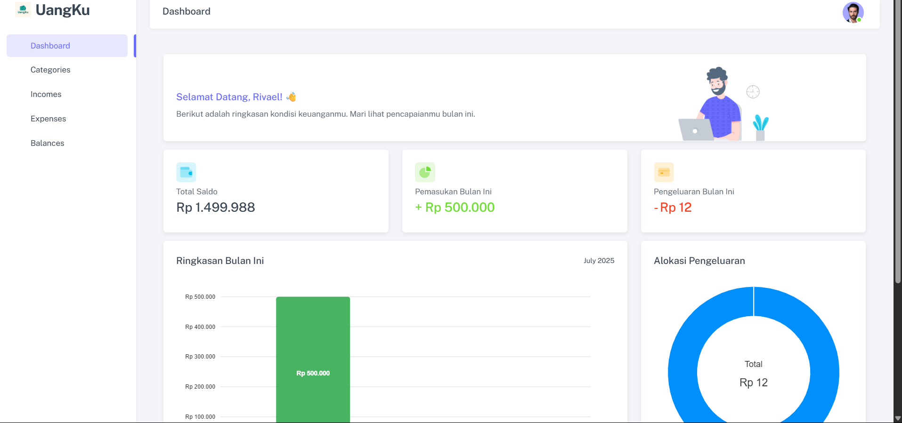

# 🏢 Sistem Absensi Karyawan GPS & Barcode - Full Stack Application

<div align="center">
  


**🚀 Sistem Manajemen Absensi Modern dengan GPS Tracking & QR Code Scanner**

**Preview: Full Stack Application Ready** ✨

**Tech Stack: Laravel 12 + PHP 8.2 + MySQL + Bootstrap 5**

</div>

---

## 🎯 **Fitur Lengkap**

### ✅ **Admin Dashboard**
- Dashboard analitik real-time dengan charts  
- Manajemen karyawan lengkap (CRUD)  
- Sistem approval pengajuan izin  
- Export laporan Excel & PDF profesional  
- Manajemen divisi, jabatan & shift kerja  
- Kontrol lokasi absensi dengan QR code  
- Profile admin dengan upload foto  

### ✅ **Employee Portal**
- Absensi GPS dengan validasi lokasi  
- QR Code scanner untuk check-in/out  
- Form pengajuan izin/sakit dengan attachment  
- History kehadiran personal  
- Interface mobile-friendly & responsive  
- Real-time status notification  

### ✅ **Security & Validation**
- GPS radius validation untuk anti-fraud  
- Role-based authentication (Admin/User)  
- CSRF protection & XSS prevention  
- File upload validation & security  
- Anti-duplicate attendance system  

### ✅ **Advanced Features**
- Multi-level icon fallback system  
- Professional report generation  
- Responsive design untuk semua device  
- Loading states & progress indicators  
- Toast notifications & modal confirmations  
- Fast loading performance  

---

## 🛠️ **Template Siap Pakai**

- **Admin Dashboard** dengan analytics modern  
- **Mobile-first** employee interface  
- **Report system** dengan export Excel/PDF  
- **User management** lengkap dengan role  
- **Location control** dengan GPS & QR code  
- **Security layer** berlapis untuk data protection  
- **Performance optimized** dengan caching  

---

## 💻 **Tech Stack Modern**

| Backend | Frontend | Database | Tools |
|---------|----------|----------|-------|
| Laravel 12.x | Bootstrap 5.3 | MySQL 8.0 | Composer |
| PHP 8.2 | JavaScript ES6 | SQLite | Git |

---

## 🚀 **Quick Start**

### **Prerequisites**
```bash
PHP >= 8.2
Composer
MySQL/MariaDB  
Node.js & NPM
Git
```

### **Installation**
```bash
# 1. Clone Repository
git clone https://github.com/RivaelManurung/absensi-karyawan-gps-barcode.git
cd absensi-karyawan-gps-barcode

# 2. Install Dependencies
composer install
npm install

# 3. Environment Setup
cp .env.example .env
php artisan key:generate

# 4. Database Setup
php artisan migrate
php artisan db:seed

# 5. Storage & Assets
php artisan storage:link
npm run build

# 6. Run Application
php artisan serve
```

**Default Login**
```bash
Admin: admin@example.com / password
User:  user@example.com / password
```

---

## 📱 **Screenshots & Preview**

### **Admin Dashboard**


*Dashboard analitik dengan real-time statistics*

---

## 🎯 **Cocok Untuk**
- **Perusahaan** yang butuh sistem absensi modern  
- **Developer** yang ingin full-stack application siap pakai  
- **Base project** untuk development HR system  
- **Portfolio** atau company profile  
- **Learning** Laravel best practices  

---

## 🔧 **Database Schema**
```sql
users          - Data karyawan & admin
attendances    - Record kehadiran harian  
divisions      - Data divisi/departemen
job_titles     - Data jabatan/posisi
shifts         - Pengaturan shift kerja
barcodes       - Lokasi dengan QR code
statuses       - Status kehadiran
```

---

## 🛡️ **Security Features**
- Laravel Sanctum authentication  
- CSRF Protection built-in  
- XSS Prevention otomatis  
- File Upload validation  
- GPS Validation untuk lokasi  
- SQL Injection prevention  

---

## 📞 **Support & Community**
- **Documentation**: [Wiki lengkap tersedia](https://github.com/RivaelManurung/absensi-karyawan-gps-barcode/wiki)  
- **Bug Reports**: [Issue tracker](https://github.com/RivaelManurung/absensi-karyawan-gps-barcode/issues)  
- **Feature Requests**: [Discussions](https://github.com/RivaelManurung/absensi-karyawan-gps-barcode/discussions)  
- **Email**: rivael.manurung@example.com  

---

## 📝 **Note**
> **Ini adalah full-stack application siap produksi** dengan fitur lengkap untuk manajemen absensi karyawan.

---

## 🤝 **Contributing**
Kontribusi sangat diterima! Lihat [CONTRIBUTING.md](CONTRIBUTING.md) untuk panduan.

---

## 📄 **License**
MIT License - lihat [LICENSE](LICENSE) untuk detail.

---

**Made with ❤️ by [Rivael Manurung](https://github.com/RivaelManurung)**  
⭐ **Star this repo jika bermanfaat!**
