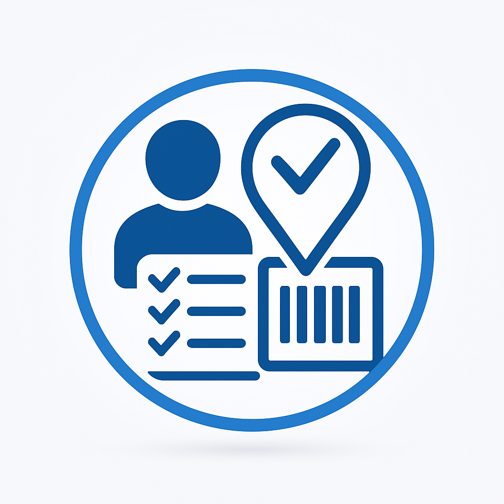
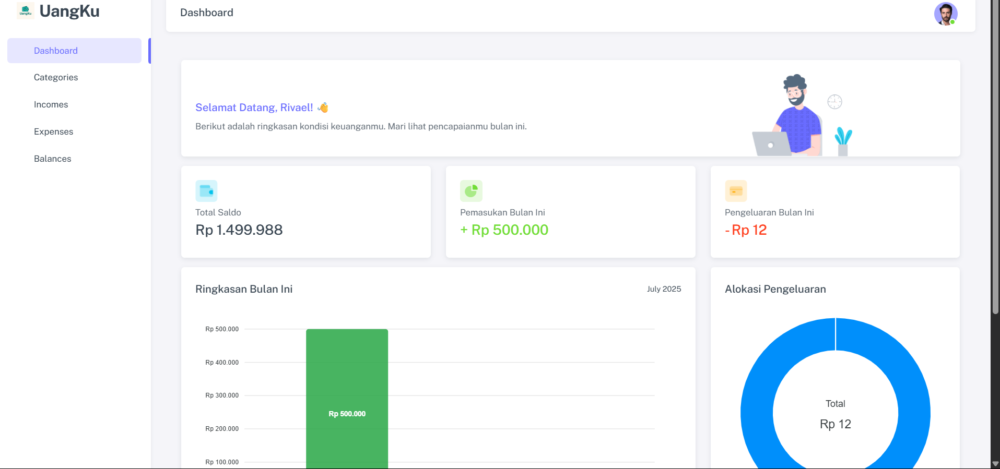

# 🏢 Sistem Absensi Karyawan GPS & Barcode - Full Stack Application

<div align="center">
  


**🚀 Sistem Manajemen Absensi Modern dengan GPS Tracking & QR Code Scanner**

**Preview: Full Stack Application Ready** ✨

**Tech Stack: Laravel 12 + PHP 8.2 + MySQL + Bootstrap 5**

</div>

---

## 🎯 **Fitur Lengkap**

### ✅ **Admin Dashboard**
✅ Dashboard analitik real-time dengan charts  
✅ Manajemen karyawan lengkap (CRUD)  
✅ Sistem approval pengajuan izin  
✅ Export laporan Excel & PDF profesional  
✅ Manajemen divisi, jabatan & shift kerja  
✅ Kontrol lokasi absensi dengan QR code  
✅ Profile admin dengan upload foto  

### ✅ **Employee Portal**
✅ Absensi GPS dengan validasi lokasi  
✅ QR Code scanner untuk check-in/out  
✅ Form pengajuan izin/sakit dengan attachment  
✅ History kehadiran personal  
✅ Interface mobile-friendly & responsive  
✅ Real-time status notification  

### ✅ **Security & Validation**
✅ GPS radius validation untuk anti-fraud  
✅ Role-based authentication (Admin/User)  
✅ CSRF protection & XSS prevention  
✅ File upload validation & security  
✅ Anti-duplicate attendance system  

### ✅ **Advanced Features**
✅ Multi-level icon fallback system  
✅ Professional report generation  
✅ Responsive design untuk semua device  
✅ Loading states & progress indicators  
✅ Toast notifications & modal confirmations  
✅ Fast loading performance  

---

## 🛠️ **Template Siap Pakai**

🎨 **Admin Dashboard** dengan analytics modern  
📱 **Mobile-first** employee interface  
📊 **Report system** dengan export Excel/PDF  
👥 **User management** lengkap dengan role  
📍 **Location control** dengan GPS & QR code  
🔒 **Security layer** berlapis untuk data protection  
⚡ **Performance optimized** dengan caching  

---

## 💻 **Tech Stack Modern**

<div align="center">

| Backend | Frontend | Database | Tools |
|---------|----------|----------|-------|
|  |  |  |  |
|  |  |  |  |

</div>

---

## 🚀 **Quick Start**

### **Prerequisites**
```bash
✅ PHP >= 8.2
✅ Composer
✅ MySQL/MariaDB  
✅ Node.js & NPM
✅ Git
```

### **Installation**
```bash
# 1. Clone Repository
git clone https://github.com/RivaelManurung/absensi-karyawan-gps-barcode.git
cd absensi-karyawan-gps-barcode

# 2. Install Dependencies
composer install
npm install

# 3. Environment Setup
cp .env.example .env
php artisan key:generate

# 4. Database Setup
php artisan migrate
php artisan db:seed

# 5. Storage & Assets
php artisan storage:link
npm run build

# 6. Run Application
php artisan serve
```

### **Default Login**
```bash
👨‍💼 Admin: admin@example.com / password
👨‍💻 User:  user@example.com / password
```

---

## 📱 **Screenshots & Preview**

<div align="center">

### **Admin Dashboard**


*Dashboard analitik dengan real-time statistics*

### **Mobile Attendance**
*Mobile-first design untuk kemudahan absensi*

### **Report System**
*Export professional dalam format Excel & PDF*

</div>

---

## 🎯 **Cocok Untuk**

✅ **Perusahaan** yang butuh sistem absensi modern  
✅ **Developer** yang ingin full-stack application siap pakai  
✅ **Base project** untuk development HR system  
✅ **Portfolio** atau company profile  
✅ **Learning** Laravel best practices  

---

## 🔧 **Database Schema**

```sql
📋 users          - Data karyawan & admin
⏰ attendances    - Record kehadiran harian  
🏢 divisions      - Data divisi/departemen
💼 job_titles     - Data jabatan/posisi
🕐 shifts         - Pengaturan shift kerja
📍 barcodes       - Lokasi dengan QR code
📊 statuses       - Status kehadiran
```

---

## 🚀 **Performance Features**

⚡ **Database Optimization** dengan indexing  
🎨 **Asset Minification** untuk loading cepat  
📱 **Mobile-First Design** responsive  
🔄 **Lazy Loading** untuk performa optimal  
💾 **Smart Caching** system  
🖼️ **Image Compression** otomatis  

---

## 🛡️ **Security Features**

🔐 **Laravel Sanctum** authentication  
🛡️ **CSRF Protection** built-in  
🚫 **XSS Prevention** otomatis  
📂 **File Upload** validation  
🌍 **GPS Validation** untuk lokasi  
🔍 **SQL Injection** prevention  

---

## 📞 **Support & Community**

🔗 **Documentation**: [Wiki lengkap tersedia](https://github.com/RivaelManurung/absensi-karyawan-gps-barcode/wiki)  
🐛 **Bug Reports**: [Issue tracker](https://github.com/RivaelManurung/absensi-karyawan-gps-barcode/issues)  
💡 **Feature Requests**: [Discussions](https://github.com/RivaelManurung/absensi-karyawan-gps-barcode/discussions)  
📧 **Email**: rivael.manurung@example.com  

---

## 📝 **Note**

> **Ini adalah full-stack application siap produksi** dengan fitur lengkap untuk manajemen absensi karyawan. Backend menggunakan Laravel dengan security berlapis, frontend responsive dengan Bootstrap, dan database MySQL yang optimized.

---

## 🤝 **Contributing**

Kontribusi sangat diterima! Lihat [CONTRIBUTING.md](CONTRIBUTING.md) untuk panduan.

## 📄 **License**

MIT License - lihat [LICENSE](LICENSE) untuk detail.

---

<div align="center">

**Made with ❤️ by [Rivael Manurung](https://github.com/RivaelManurung)**

⭐ **Star this repo jika bermanfaat!**

</div>
